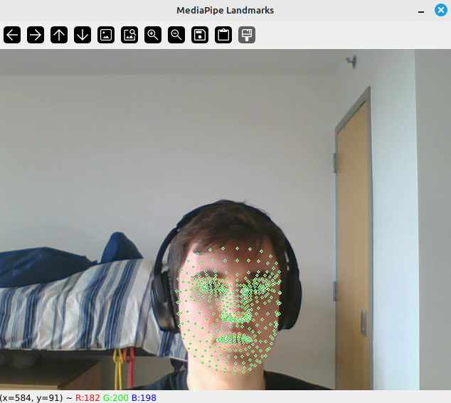

Install dependencies:
---

```
python3.10 -m venv env
source env/bin/activate
pip install -r requirements.txt
```

To run:
---

```
python mediapipe_vid.py
```

---
Frames can be viewed with or without index


